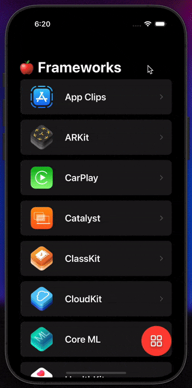
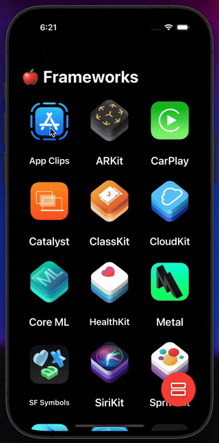

# SwiftUI Apple Frameworks App

Welcome to my SwiftUI study project! This app serves as a learning tool for me to explore and test my skills with SwiftUI. The app lists various Apple frameworks, allowing you to toggle between list and grid views and providing detailed information about each framework with a navigation feature to the official Apple website.

## Features

- Display a list of Apple frameworks with icons and names
- Toggle between list view and grid view using a floating action button
- Navigate to a detailed screen with more information about the selected framework
- Button to redirect to the official Apple website for the selected framework

## Requirements

To run this project, you need:

- Xcode 13 or later installed on your macOS device
- Basic understanding of Swift and SwiftUI

## Installation

1. Clone or download this repository to your local machine.
2. Open the project in Xcode by double-clicking the `.xcodeproj` file.
3. Build and run the project using the simulator or your physical device.

## Preview

## Resources

- [SwiftUI Documentation](https://developer.apple.com/documentation/swiftui) - Official documentation for SwiftUI provided by Apple.

## Contributing

As this is a study project, contributions and suggestions from experienced developers are highly appreciated! Feel free to open an issue or submit a pull request if you have any feedback or improvements.

## License

This project is licensed under the MIT License - see the [LICENSE](LICENSE) file for details.

